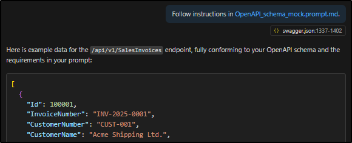

# 2025w29 - Sleep

Date: July 20, 2025
Cover Picture: IMG_20250720_111759.jpg

# #1 Personal ✒️

## Personal Note - Reflections on the Week and Blog Ideas

### When the Brain Won't Switch Off

Let’s be honest: this week was a bit of a blur. I found myself sitting on my terrasse yesterday, thinking about my blog and realizing I hadn’t collected any topics - not even had a single on in mind. The week was turbulent—one of those stretches where life throws you curveballs and your best-laid plans go out the window. I almost decided to skip a section entirely or just write a short note. But then, as it often happens, thoughts started popping up from all directions.

### Health Check-In: Why Was My Sleep Off?

One thing that kept nudging me was my sleep—or rather, the lack of it. I caught myself wondering: why didn’t I sleep well this week? Was it stress, too much screen time, or just the usual ebb and flow? It’s a classic reality check for me. I try not to chase perfection, but I do like to pause and ask what’s really going on. Maybe it’s time to tweak my evening routine or just accept that some weeks are like this. 

Read on in the [#3 Sports, Food & Health 🏋️🚴🥦](https://www.notion.so/3-Sports-Food-Health-234b04fbcf9581468f74d9638d6f3140?pvs=21) section

### AI Curiosity: Inspiration from the **AI Engineer World's Fair 2025**

Despite the chaos, I managed to catch a few posts from the recent AI Fair. There’s something about seeing the latest in generative AI and LLMs that always sparks my curiosity. How do these models actually work under the hood? What can we learn from their architecture to improve our own workflows? I love experimenting with new tools and thinking about how they might fit into my daily routines—sometimes it’s about the big picture, sometimes it’s just a small tweak that makes things easier. 

I also reflected a bit on intelligence in correlation with AI and LLMs. It is my personal thoughts, conclusions and understanding of how things work. 

Read on in the [#4 Inside AI 🤖](https://www.notion.so/4-Inside-AI-234b04fbcf958118a7a7fc357e2bddae?pvs=21) section.

### Technical Tinkering: OpenAPI Metadata & Mock Data

On the technical side, I made some progress with OpenAPI metadata and generating test data for building mocks. It’s not a headline-grabbing achievement, but being able to quickly spin up realistic test data is a real productivity boost. If you’re working with APIs, I highly recommend exploring how OpenAPI can help streamline your development process. (Mental note: check if I already wrote about this last week!)

### Progress in the Margins: Book Updates

I also chipped away at a book about AI I’m reading. No major breakthroughs yet, but sometimes progress is just about showing up and moving forward, even if the big insights are still on the horizon. That’s part of the learning journey—trusting that the **dots will connect eventually**. (no pun intended - [2025w14 - Connecting Dots](https://www.notion.so/2025w14-Connecting-Dots-1ccb04fbcf958062b070e3acb16eb0ed?pvs=21))

### Your Turn: How Do You Handle Turbulent Weeks?

This week reminded me that it’s okay to have quieter periods, to reflect, and to let inspiration come from unexpected places. How do you handle weeks when things don’t go as planned? Any recent insights about sleep, AI, or your own learning process? Drop a comment or share your thoughts—I’d love to hear from you!

---

**Enjoy reading and don’t forget to leave some feedback.**

# #2 Tech 💻

## Efficient API implementation while preserving GDPR

In one of my projects we need to integrate an API which delivers data for the customers invoicing process. The vendor of the interface has set up a test system where the customer can insert data and get to know the system. We got the interface specification via an OpenAPI description and a Swagger documentation. So to build our interface implementation we can run some requests against this API. 

However all this is on the customer site and on-premises. So when we developers want to test our implementation candidates locally on our machines we have a problem. Yes we could take the payload and put it into a local mock server but then you need to share this mock data with all developers and when you need to update something…. - you know the hassle.

I took another approach here and created a Postman mock server for the API and the different endpoints. Of course I do not want to upload the payload - with customer data - into this mock. I want to keep privacy save. It was also not an option to use the payload and ask an AI to obfuscate the data - I would still give this data out of our hands.

So how to approach this problem? Well the API has an OpenAPI schema which describes all endpoints and its elements with data types - so why not use this in combination with AI to generate some artificial test data payloads for the mock.

Here is the prompt I used:

```markdown
Please provide example data for the /api/v1/SalesInvoices endpoint based on its OpenAPI specification, conforming to:

1. The complete HTTP 200 success response schema
2. All nested object structures and subschemas
3. All required and optional fields with realistic sample values
4. Proper data types and formats as defined in the schema
5. Any array items with at least 2 examples per array
6. Valid enum values where specified
7. Adherence to any minimum/maximum constraints
8. Proper formatting of dates, timestamps, and special formats
9. Representative business logic values (e.g. calculated totals)
10. Consistent and logically related data across nested objects

Please share the OpenAPI specification so I can generate appropriate example data.
```

When building these small tools to help me I create a new folder for this task in the project folder and add a subfolder “.github/prompts” where I store the prompt - so I can use those directly in vscode when opening the task folder with it.

I can also get back to it later and adjust the prompt, add more files to be considered and I can also share this little helper with others.

Here is a screenshot of actually using the prompt in vscode:



Normally I start the GitHub Copilot in “Agent” mode and then start typing “/” to select the relevant prompt from the prompts folder. If you have the file open on which the operations should be processed you just need to hit enter - otherwise just drag and drop the file into the chat to add it to the context.

It is such a small thing but it is a major helper and it keeps customer data save. Another aspect I have not thought about before reading the AI book by IBM (AI Value Creator) is that I am not depending on a specific AI or model. Everything is exchangeable. Yes I use vscode but I could also use cursor or just a GPT chat of my choice to do exactly the same. I can even host a LLM on my computer to run those prompts.

**For me that is the real beauty of this approach - shareable, independent, reproduceable, secure.**

# #3 Sports, Food & Health 🏋️🚴🥦

## The Importance of Sleep

### When Sleep Slips, Everything Feels Off

Let’s be honest: sleep is one of those things we all know is important, but it’s easy to underestimate just how much it impacts everything else. This week, I had a rough night—personal reasons, not much rest—and I felt it immediately. My focus was off, my energy dipped, and even my workouts took a hit. At Saturday’s CrossFit birthday session, my performance just wasn’t there. It’s humbling how quickly a lack of sleep can ripple through your days.

### Why Deep Sleep Matters (and How Much You Really Need)

If you look at the research, it’s pretty clear: most adults need about 7–9 hours of sleep to get enough deep sleep (slow-wave-sleep) phases. That’s when the real magic happens—muscle repair, hormone regulation - open the hormone expand below for some nerd details. Those tiny muscle tears from training? They’re patched up while you sleep. It’s all part of the body’s natural recovery process, and it only works if you give yourself enough time in bed.

- **hormone nerd details during deep sleep**
    - **Growth Hormones (HGH)**: Released in greater amounts during sleep, especially in **deep sleep (Slow-Wave Sleep) and REM sleep**, essential for tissue regeneration, muscle building, and bone strengthening. Reduced by sleep deprivation or interruptions.
    - **Testosterone**: Also released during sleep, important for muscle regeneration and repair.
    - **Cortisol (Stress Hormone)**: Production significantly **reduces during sleep**. **Insufficient sleep leads to increased cortisol levels**. High cortisol inhibits muscle growth and repair, promotes muscle breakdown and fat storage, and hinders healing processes.
    - **Melatonin**: Produced during sleep, helps regulate the sleep-wake cycle.
    - **Insulin Sensitivity**: Affected by sleep; lack of sleep makes it harder to build muscle and burn fat.
    - **Ghrelin and Leptin**: Sleep deprivation can disrupt these hunger/satiety hormones, potentially leading to increased hunger and poor food choices.

### Building Better Sleep Habits: What Actually Helps

I’m not perfect here, but I’ve learned a few things that make a difference:

- **Limit screen time before bed.** The blue light from phones and laptops really does mess with your sleep cycles. I try to swap the screen for a book in the evening.
- **Create a relaxing routine.** Sometimes it’s a bit of calm music, sometimes a short meditation or gentle yoga. Anything that helps the body and mind wind down. (personal note: I have not found my best routine yet.)
- **Keep it dark and cool.** I use a sleep mask, especially in summer when the early sunrise can sneak in. It’s a small thing, but it helps me stay asleep longer and calmer.

### What I’m Still Figuring Out

I know there’s more to learn about sleep—like the different phases, and how to optimize each one. Maybe next time we talk about sleep I’ll dig into the science a bit more and share some practical tips. For now, I’m focusing on the basics: more rest, better routines, and paying attention to how I feel.

### Your Turn: How’s Your Sleep?

How do you handle nights when you just can’t get enough rest? Any tips or routines that work for you? Drop a comment or share your experience—I’m always looking to learn from others!

---

**Here’s to better sleep and showing up for ourselves—even when we’re a little tired.**

# #4 Inside AI 🤖

Tools make AI thinking deeper not the models?

Week 18 on memory.

---

## The Learning Mechanism of LLMs

### How LLMs Evolve: More Than Just Smarter Answers

Let’s start with a confession: I’m endlessly fascinated by how large language models (LLMs) learn and adapt. It’s easy to think of them as static tools, but the reality is much more dynamic—and honestly, a bit mind-bending.

### From Simple Answers to Smarter Tools

In the early days, interacting with an LLM was straightforward: you asked a question, and the model spat out an answer based on what it “knew” from its training. But things have changed rapidly. Researchers realized that with reinforcement learning, you could fine-tune these models, making them more specialized and responsive. The result? Smarter, more adaptable AIs that can handle a wider range of tasks.

### The Rise of Tooling: Prompts, Profiles, and Memory

What’s really exciting is how the ecosystem around LLMs has evolved. We now have metaprompts, system prompts, and even user profiles that let you store your own preferences and data. This means the model can respond in a way that feels more personal and relevant. And then there’s memory—not inside the model itself, but as a supporting tool. This lets the AI “remember” previous interactions, making conversations feel more natural and context-aware.

### Thinking Modes: Iteration as a Superpower

One of the coolest developments is the idea of “thinking modes.” Instead of just giving you the first answer it comes up with, the model can now loop through multiple iterations, refining its output each time. Sometimes, it even runs these loops in parallel, exploring different possibilities before settling on the best result. It’s a bit like brainstorming with a team—except the team is all AI, working at lightning speed.

### Drawing Parallels: The Brain and Beyond

It’s hard not to compare this to how our own brains work. We have different regions for different tasks, and our thinking often involves looping back, re-evaluating, and connecting ideas. If we ever reach true general AI, I suspect it’ll be built from a similar patchwork of specialized components, each contributing something unique.

### The Edge of AI: Speed, Scale, and Curiosity

Here’s where AI really pulls ahead: data access and processing speed. With tools like MCP servers, LLMs can tap into vast data sources almost instantly—something our brains can only dream of. Sure, we have memories and intuition, but sometimes it takes a while to dig up the right insight. AI, on the other hand, can surface information ad hoc, making it a powerful partner for research, creativity, and problem-solving.

### What’s Next? Let’s Stay Curious

The pace of change in AI is staggering, and I’m genuinely excited to see what comes next. How will reinforcement learning evolve and what others aspects of learning we will see? What new tools will make our interactions even more seamless? And how can we balance the strengths of AI with our own human intuition and critical thinking?

How do you see the future of AI unfolding? Are there aspects of LLMs or AI tools you’re especially curious about? Drop a comment or share your thoughts—I’d love to hear your perspective!

---

**Here’s to staying curious, learning together, and building smarter systems—one iteration at a time.**

---

Here is a good talk about “artificial Thinking”:

[Thinking Deeper in Gemini — Jack Rae, Google DeepMind](https://youtu.be/8EQo4J2BWKw?si=ywTIu1e85IpcHE7m)

# #5 Media of the week 🎶📺

Like I mentioned above I managed to watch some sessions of the **AI Engineer World's Fair 2025.** There is a variety of speakers about all sorts of topics - really condensed in short (~30min) talks. Some are more interesting than others but that I guess is personal preference.

Here is the link to the keynote - find the other talks on the channel:

[AI Engineer World's Fair 2025 - Day 1 Keynotes & MCP track ft. Anthropic MCP team](https://www.youtube.com/live/z4zXicOAF28?si=0S2QBpYYp-HLja_7)

---

One of my favourite session from the BC TechDays 2025 have been published on the mibuso YouTube channel. It reminded me again on how important it is to think about testing in the beginning, starting with test cases which will also describe the functionality you are going to build. It will give you a much better picture and help you think deeper about the problem. Another eye-opener was the lab section where Tine Starič showed what might be possible with Page Scripting.

[Testing is Boring... Until Now!](https://youtu.be/-DJ8Yn8VNeA?si=wIClKwofPpNo2EUx)

- Here are the key aspects of the "**Testing is Boring... Until Now!**" video:
    - **Manual testing is inefficient and costly**, leading to teams "drowning in regression tests" and making bugs significantly more expensive to fix when found later in the development cycle. Automated tests, unlike manual ones, retain their value over time as they can be run repeatedly.
    - **Traditional AL coded tests** are developer-heavy, requiring unique code for each scenario and running in isolation, which necessitates specific setup and cleanup for each test.
    - **Page Scripting** allows non-developers (e.g., consultants) to record and replay UI steps, reducing development effort for test automation. It's also valuable for bug reporting and generating visual reports or instructional videos of test execution in pipelines.
    - **Data-Driven Testing (DDT)** enables a single AL test to execute numerous test cases defined in external files (like JSONL or YAML), which is particularly crucial for testing AI features with diverse inputs and outputs. This approach reduces the bottleneck on developers by allowing functional roles to contribute test cases.
    - The most effective testing strategy is a **combined approach**, where organizations start with page scripts, evolve them into more efficient AL tests, and then utilize data-driven tests for further optimization. This distributes the testing workload across both functional and development roles.

# Feedback 📣

Here you can give me feedback, send ideas or just connect with me. Just leave a comment.

[https://tally.so/embed/waKjo9?alignLeft=1&hideTitle=1&transparentBackground=1&dynamicHeight=1&week_hidden=2025w29](https://tally.so/embed/waKjo9?alignLeft=1&hideTitle=1&transparentBackground=1&dynamicHeight=1&week_hidden=2025w29)

---

[Untitled](Untitled%20234b04fbcf9581c39258d1eecf337d9e.csv)

---

©️ Christian Czupras - 2025