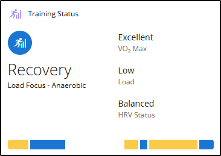

# 2025w30 - [Title]

Date: July 27, 2025

# #1 Personal ✒️

## Personal Note

Hello folks, just a short note here this week - I wrote more text in the following sections. I managed to create the article for the tech section already before the weekend - well at least the audio recording.

The remainder of this blog was spontaneous with a big cup of coffee this morning. Mainly I just wanted to add the two videos by Andrej and then you know it already - my thoughts went wild. That is what I love about this writing. Just think about what has happend the last week and note it down, formulating ideas and memories into action items and recommendations. For me in the future to look back and for you to hopefully get inspiration.

---

**Enjoy reading and don’t forget to leave some feedback.**

# #2 Tech 💻

## **When App Development forces you to break your own rules**

Some weeks ago, I wrote about a Document Management System (DMS) app I've been building for a customer. I was quite excited to share that I had completed the first release candidate and deployed it to the test system. And you know what? It worked – it actually worked fine! Sure, there were a few minor issues that I missed during testing (as is always the case), but we quickly fixed those, and I was genuinely happy with how everything was functioning.

### **When requirements evolve mid-development**

Then came the twist in the story – a new requirement emerged - well not totally new. The system now needed to handle not just the main document but also attachments. We're talking about managing multiple documents per Business Central purchase invoice, for example.

Here's the frustrating part – I knew from the beginning that attachments would eventually be part of the system. But in my initial concept, I didn't fully implement this functionality because I naively thought, "It's just another document to upload, right?" Wrong. Very wrong.

### **The Love-Hate relationship with Interfaces**

Having finished the app and implemented quite a lot of interfaces (which I generally love), I've come to realize something: interfaces are like contracts, and you're not allowed to break contracts. That's where my relationship with them becomes complicated.

Now that I need to implement functionality for attachments, I'm facing the reality that I need to make some breaking changes and rework almost the entire app. I need to create a path for the attachments and add the ability to distinguish between a main document and multiple attachments.

This has been quite the mental challenge to work through, I'll admit. After thinking it through, I believe I've figured out a solution – but it means breaking every single interface I created.

### **Refactoring for the Better**

The silver lining here is that I'm actually implementing more procedures into the interfaces, which is ultimately better for the architecture. I'm essentially refactoring the app to make it stronger and more robust.

Fortunately, this app isn't yet in a production environment, which means I have some flexibility. I can bend the rules a bit and make breaking changes without going through the usual rigorous processes. This is precisely the part where I don't love interfaces – when you make a mistake, it requires significant work to create an interface version 2 or a completely new interface, then rework everything to ensure you don't break anything data-wise.

But in this case, I'm lucky. I can make these changes without too much fallout.

### **Exploring AI Assistance for Optimization**

Before I wrap up this project, I'm considering asking Copilot to help me optimize the interface usage and procedures. I've already refactored quite a lot of procedures, but I'm curious to see what an AI assistant might suggest and whether those suggestions will actually improve the codebase.

Will the copilot spot patterns I've missed? Will it suggest more elegant solutions to my interface challenges? I'm genuinely intrigued by what might come from this experiment, and I promise to share the results once I have them.

### **The Lesson Learned**

If there's one thing I'm taking away from this experience, it's to be more thorough in my initial concept development – especially when I already know certain features will be needed down the line. Interfaces are powerful tools in development, but they require careful planning to avoid the exact situation I'm in now.

---

**What about you? Have you ever found yourself having to break your own architectural rules mid-development? How did you handle it? I'd love to hear your experiences in the comments below.**

# #3 Sports, Food & Health 🏋️🚴🥦

## Training Status

A picture says more than 1000 words:

To make it short - this week there are no learnings - I just did a bit of training and I did not try anything fancy - not even in the kitchen.

# #4 Inside AI 🤖

## Breakdown

I stopped following the daily AI news in detail. Why? Because it is way too much information and all the news is mostly hype what new functionality is available and which new model is out and how it performs. But I am not interested in the benchmarks but rather how can I make use of AI in my daily life to make it easier (that's what they all say is going to happen with AI).

Well to a certain degree I go along with that - for example you do not need to surf the world wild web (pun intended) to find the right tool for a task you want to do and have never done before. We all know that - there is a task and you think: “there must be a tool or an app for this…” - after minutes or hours we find something, try it and it does not really fit the task, we search again, try and fail or succeed. But at the bottom line it takes a lot of time and you might end up with a lot of tools installed that you need to clean up again. Don’t get me wrong, dedicated software and tools are great and their owners deserve the respect that they build it. But for some small tasks or little helpers for everyday people this might not be the right thing. Here I find GenAI and the current chatbots really helpful. 

You can just tell what you want in natural speech and eventually you get recommendations of software, tools, you get an immediate answer to your problem, because the AI could solve it already or the AI will build a custom tool just for you. This can be a simple script that you execute or a whole app.

Ok, before this gets too long here I will tell you what I learned this week about this kind of AI use.

During the week I have a lot of ideas but also a lot of tasks I need to do. Most of these duties have to do with some kind of data - so I have some input and I need to generate output. What I tend to do is create a dedicated folder for the task, give it a proper name and save everything related to it there.

> Within the PARA Method that would be a little project if it takes some days to get to the result or a resource if it is small and worth sharing - if non of these apply it will be an area - this is how I structure my data.
> 
> 
> [The PARA Method: The Simple System for Organizing Your Digital Life in Seconds](https://fortelabs.com/blog/para/)
> 

Then I start with a prompt file (markdown) to describe what I want to do - this helps me to reflect on the task - think of trying to explain this to a young colleague. It does not need to be perfect, but put in details that are important. With this written down you can ask an AI to “boost” and optimize your prompt if it is more complex - if it is simple then just go ahead and let’s save that energy (think economically and green as far as this is possible with AI - [What does it actually cost to use AI?](https://www.notion.so/What-does-it-actually-cost-to-use-AI-23db04fbcf9580a7876af45b998c83b7?pvs=21) )

The AI - I really like to work in vscode with this and make use of GitHub Copilot because I have all in one place - then goes to work and eventually generates me a re-usable script.

I would recommend not to try to do complex tasks in one go. Break it down into smaller chunks and tackle one problem at a time - this helps you understand it better and the AI will also perform better.

One benefit is also that you are in control of the small steps and can oversee it. 

**So main learning here - break task down and tackle one thing after another - AI can also help to break it down in tasks and add those to the prompt file - give it a try.**

<aside>

[Andrej Karpathy](https://www.notion.so/Andrej-Karpathy-23db04fbcf9580b38f1bf78dd24e324d?pvs=21) gives some nice comprehensive examples in his videos.

</aside>

---

### An example

Let me give you a quick example from this week. I had to do my tax statement for 2024, in this I need to specify how many home office days I had and how often I commute to work. Do I note that down during the year? No - unfortunately not. Well I use Google Maps and I also opted-in for saving the timeline. Great I thought - I can use the timeline to figure out how often I have been to my work place.

Well kinda, the export of the timeline is a huge json file (data since a decade). No tool will get me what I need - and the name of the city or place is not even in this file, only coordinates.

So I broke things down into peaces - to make it short the actions will follow in bullets:

- cut the data to only contain data from 2024 → smaller json file
- give the first 100 lines to Copilot and ask to build a script to generate a csv file
- ask AI to build a script to obtain the city based on the coordinates and add it to the csv as a new column
- load the csv in excel
- do some pivot magic to get the data I want

That worked great and **I can use this again next year 🎉.**

Of course it can be optimized even more but that I will save for next year - until now I have what I need.

---

**Do you have such examples - tell me I would love to hear about it.**

# #5 Media of the week 🎶📺

### Andrej Karpathy

If you are following the AI world you must have heard of Andrej Karpathy - I have too but have not yet read an article or seen a talk by him until this week. And then I even watched two videos packed with content.

First one was a talk about Software development and AI

[Andrej Karpathy: Software Is Changing (Again)](https://youtu.be/LCEmiRjPEtQ?si=0pvHsZet1GenQECI)

That one made me curious about more talks of him, because the first one was already really good. So I found on his own YouTube channel the following one:

[How I use LLMs](https://youtu.be/EWvNQjAaOHw?si=g-pSLLeS2jleeRY8)

Well what can I say - instead of a blockbuster on Saturday I watched the whole video which is a bit more than 2 hours long - and it is definitely worth it. I also wrote about it in the AI section.

### What does it actually cost to use AI?

In this podcast the two speakers discuss how much AI request are costing. Really interessting - only german - but you know what to do if you do not understand german… 

[KI-Update Deep-Dive: Der wahre Preis einer KI-Anfrage](https://www.heise.de/news/KI-Update-Deep-Dive-Der-wahre-Preis-einer-KI-Anfrage-10490664.html)

# Feedback 📣

Here you can give me feedback, send ideas or just connect with me. Just leave a comment.

[https://tally.so/embed/waKjo9?alignLeft=1&hideTitle=1&transparentBackground=1&dynamicHeight=1&week_hidden=2025w30](https://tally.so/embed/waKjo9?alignLeft=1&hideTitle=1&transparentBackground=1&dynamicHeight=1&week_hidden=2025w30)

---

[Untitled](Untitled%2023bb04fbcf958153a5decc8d47410599.csv)

---

©️ Christian Czupras - 2025